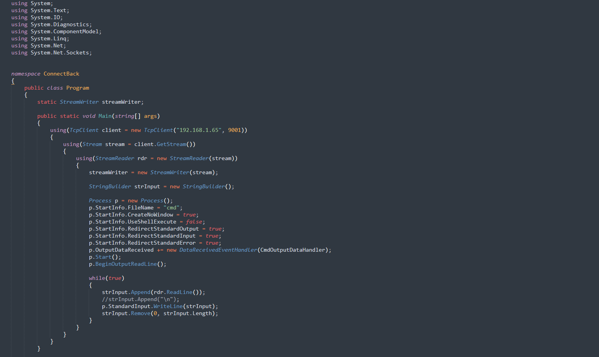
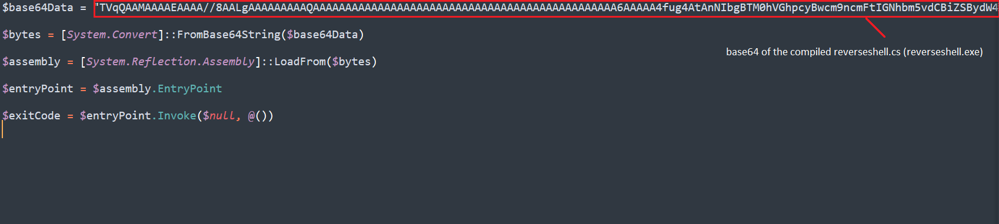
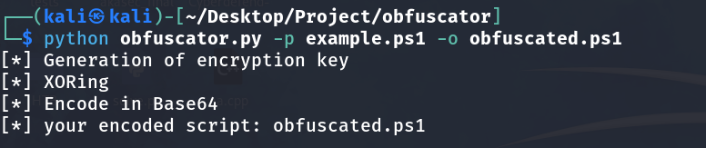
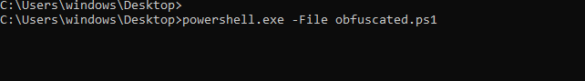
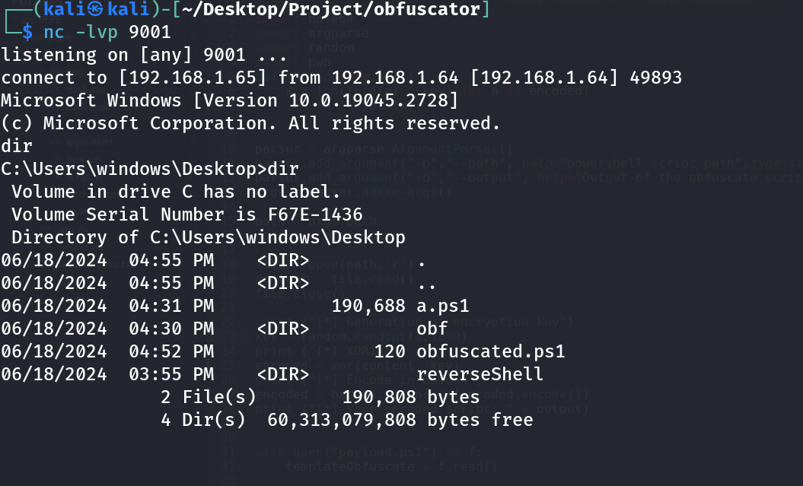

# Simple_Powershell_Obfuscator

*tool for powershell script obfuscation*

# example

#### Reverse shell script written in C#. 
> The script is provided for educational purposes only and should not be used for malicious activities.

*After compiling the C# program, a simple PowerShell script is provided to load the assembly and invoke the main method of the executable.*

*After executing the tool, we received an obfuscated version of the initial script, now named `obfuscated.ps1`*

*We then start a listener on the attacker's machine and execute the `obfuscated.ps1` script on the victim's machine*

> And we got the shell!
